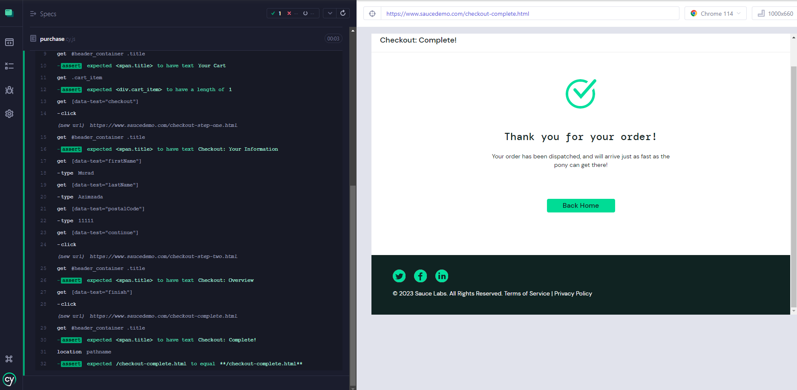

Saucedemo automation test

## Prerequisites

- Node.js and npm must be installed on your machine.

## Setup

1. Clone this repository: `git clone https://github.com/AzimzadaMurad/sauce-automation.git`
2. Navigate to the project folder: `cd sauce-automation`
3. Install dependencies: `npm install`

## Running Tests

1. Open the Cypress Test Runner: `npx cypress open`
2. Click on "purchase.cy.js" under the "e2e" folder.
3. The tests will automatically run in a new browser window.

## Folder Structure

- `cypress/e2e`: Contains the test files.
- `cypress/support`: Contains support files, such as commands and custom functions.